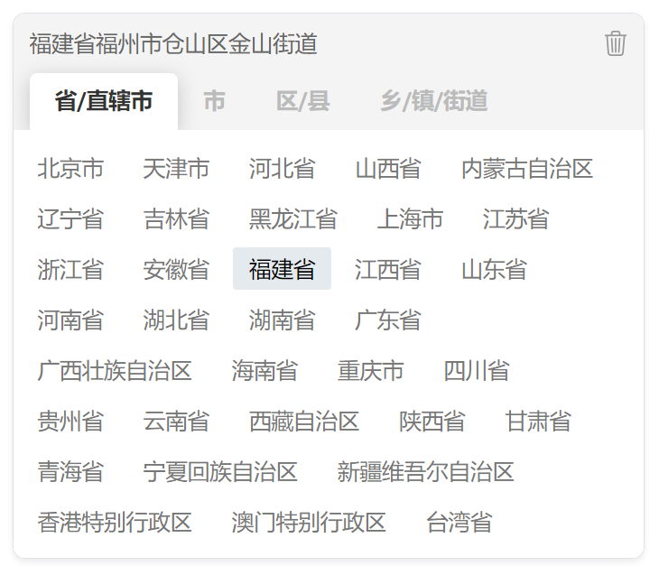

<div align="center" style="margin-top: 100px;margin-bottom: 100px;">
  
</div>

# [v-region](https://terryz.github.io/vue/#/region)

[](https://circleci.com/gh/TerryZ/v-region/tree/master)
[](https://codecov.io/gh/TerryZ/v-region)
[](https://www.npmjs.com/package/v-region)
[](https://standardjs.com)
[](https://www.npmjs.com/package/v-region)

简洁强大的中国行政区划选择器，可选择 “省/直辖市”、“市”、“区/县”、“乡/镇/街道” 4 级行政区域
A simple region cascade selector for vue, provide 4 levels Chinese administrative division data

行政区划数据源更新日期：`2022年05月18日`

如果你的项目正在使用 vue `2.x` 版本，请使用 [v-region 2.x](https://github.com/TerryZ/v-region/tree/dev-vue2) 版本

## 文档与实例（Documentation and Examples）

更多的文档与实例请浏览（Explorer on）

- [Github pages](https://terryz.github.io/vue3/region/)

## 功能特性（Features）

- “省/直辖市”、“市”、“区/县”、“乡/镇/街道” 4 级行政区域选择
- 丰富的使用形式，提供了
  - 下拉列表级联模式 `RegionSelects`
  - 分组模式 `RegionGroup`
  - 多列竖排模式 `RegionColumns`
  - 城市选择器模式 `RegionCityPicker`
  - 纯文本模式 `RegionText`
- 分组 `Group` 与多列 `Columns` 模式可直接使用核心模块 `RegionGroupCore 与 RegionColumnsCore`，结合其他交互形式可自由组合更多种多样的使用形式，例如结合抽屉 `Drawer`、气泡 `Popover` 或对话框 `Dialog` 使用
- 部分模式允许使用作用域插槽 `Scoped Slots` 的方式自定义触发对象，让组件更方便于整合在业务场景中
- 除省级以外，其它行政区域级别可通过参数进行切换
- 支持 “直辖市”、“特别行政区” 、“地级市（直筒子市）” 和 “省辖县/省辖县级市” 等特殊行政区域的数据和内容处理

## 安装插件（Installation）

[](https://www.npmjs.com/package/v-region)

```sh
npm i v-region
```

在项目里全局安装所有功能模块

```js
import { createApp } from 'vue'
import App from './app.vue'
import Region from 'v-region'
// 全局安装
// RegionGroup
// RegionSelects
// RegionColumns
// RegionCityPicker
// RegionText
// 模块
const app = createApp(App)
app.use(Region)
app.mount('#app')
```

自定义全局安装模块

```js
import { RegionSelects } from 'v-region'

const app = createApp(App)
app.component('v-region-selects', RegionSelects)
```

## 在页面中使用（Usage）

```vue
<template>
  <RegionSelects
    v-model="region"
    @change="change"
  />
</template>

<script setup>
import { ref } from 'vue'
import { RegionSelects } from 'v-region'

const region = ref({
  'province': '350000',
  'city': '350100',
  'area': '350104',
  'town': '350104008'
})
function change (data) {
  console.log(data)
}
</script>
```

## License

[](https://app.fossa.io/projects/git%2Bgithub.com%2FTerryZ%2Fv-region?ref=badge_large)

## Star数趋势（Stargazers over time）

[](https://starchart.cc/TerryZ/v-region)

## 数据源（Data Source）

Region data come from repo: [mumuy/data_location](https://github.com/mumuy/data_location)

> **原仓库数据说明**
> 省、市、区数据来自于民政局、国务院公告、国家统计局，确保及时更新和权威；
> 街道(镇、乡)数据由于数据庞大，各地各级之前公函较多，无法保证及时有效（最新数据2016年7月31日）；
> 数据是以行政区为单位的行政区划数据。行政管理区与行政区存在重合，不予收录;
> (行政管理区通常包含:***经济特区/经济开发区/高新区/新区/工业区；亦有部分行政管理区升为行政区，需加以区分)
